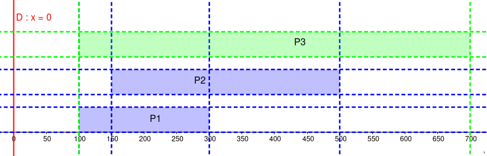
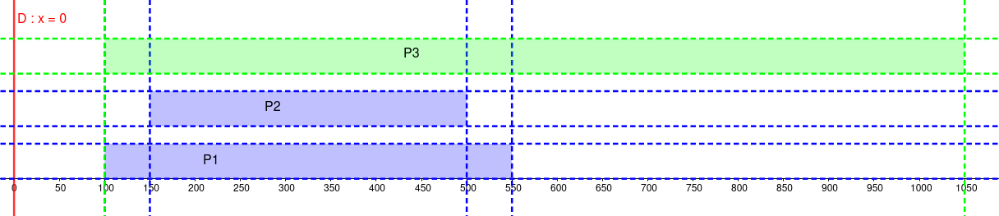
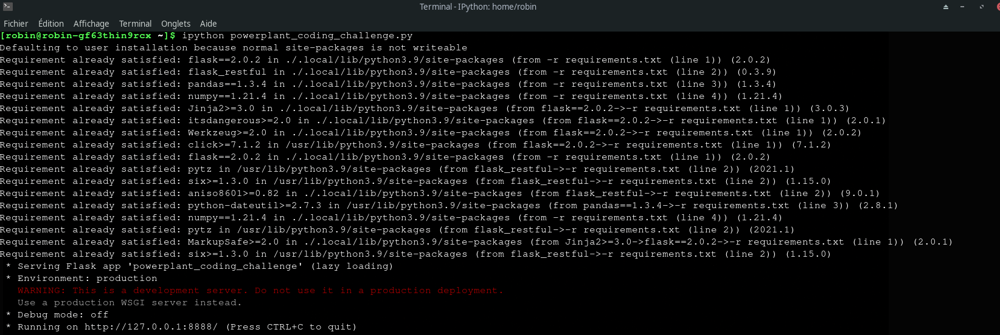
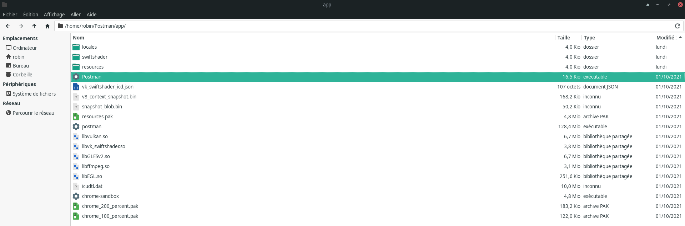
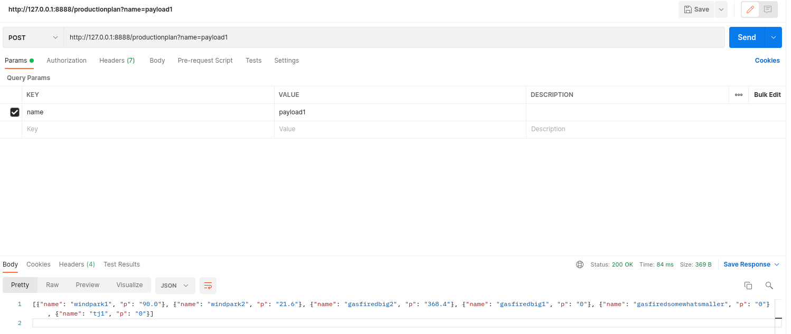
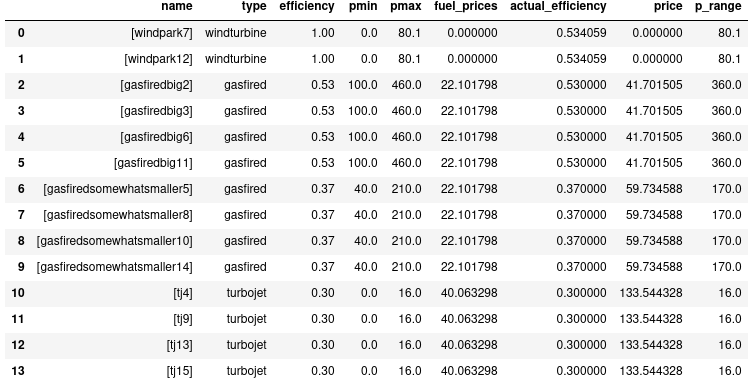
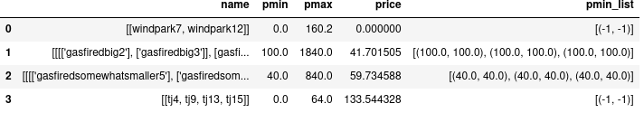
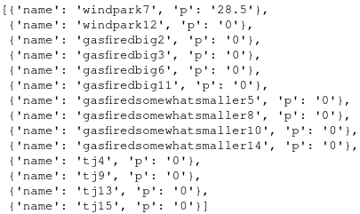

# Powerplant Coding Challenge : Round 2<br>

by &copy; Robin Munier (Since 1995)

<hr style="border:2px solid gray">
<br>


## **Introduction** <a id='introduction'></a>

This is my solution to the powerplant-coding-challenge proposed by the SPaaS team of ENGIE here : https://github.com/gem-spaas/powerplant-coding-challenge<br>

I already proposed a first solution (corresponding to the last version of this repository, published on the 18th of November). After a first round, ENGIE decided to open a second round.<br>

The first round of the challenge was an opportunity to devote myself to my favorite activity : failure, also known as learning. Committed to unit commitment, I am not only full of energy, I am full of renewable energy, so I decided renew my previous solution in order to tackle the second round (I hope for this second round that it uses shin guards).<br>

My first solution matched all the acceptance criteria defined by the rules. Besides, my solution always give the best possible result given the constaints (the formats are respected, the production is always matching the load, the power allocated to each powerplant is a multiple of 0.1 MW, the pmin and pmax of each powerplant is respected, the cost is as low as possible while matching these criteria).<br>
Besides, the rules require to not use any existing solver. Consequently, I did not use any existing algorithm (whatever it would come from an existing python package or from a book or research paper). Under this constraint, some challengers probably just used a big loop computing all the possible valid production plans in order to choose subsequently the one which implies the smallest cost. Others thought it was sufficient to successively allocate the remaining load to the available powerplants by order of price by MWh. That is not what I did : my solution is valid and I used several tricks to reduce the computation time of my algorithm.<br>

I hence diagnosed two probable issues with this first solution :<br>
- It does not contain a lot of explanations about the optimization process I used (exept docstrings to define each function). On another side, this part of the code is pretty self-explanatory (I guess it should be clear for experts with a quantitative or programming background). It seems more relevant to me to not spend too much time on this challenge and to explain the details during an interview. Besides, after having looked at the solutions proposed by other challengers for the first round, I did not see deep explanations of the optimisation process (or even just a working solution). <br><br>
- It does not contain any of the three bonus tasks (providing a Dockerfile, a websocket server connection, or taking into account the costs of CO2 emissions).<br><br>

Thus, this second solution contains the first one plus added explanations and a consideration of the emission allowances (I am so ecological that I also recycle my work : I have the perfect profile to work for Engie).<br>

Note that the mathematical formulas handcoded in LATEX are not rendered on github, so download this README file on your own computer and open it with a suited tool (like a Jupyter notebook).<br>


## **Table of content**<br>

[Introduction](#introduction)<br>
[I. Preliminaries](#I)<br>
&nbsp;&nbsp;&nbsp;&nbsp; [I.1 Introduction to mergeable powerplants](#I.1)<br>
&nbsp;&nbsp;&nbsp;&nbsp; [I.2 Why to introduce mergeable powerplants ?](#I.2)<br>
&nbsp;&nbsp;&nbsp;&nbsp; [I.3 How did I ensure that the power produced by each powerplant is a multiple of 0.1 ?](#I.3)<br>
&nbsp;&nbsp;&nbsp;&nbsp; [I.4 How did I take into account the costs of emission allowances ?](#I.4)<br>
[II. Installations](#II)<br>
[III Imports](#III)<br>
[IV Definition of some useful functions](#IV)<br>
[V Initialization of the API](#V)<br>
[VI Endpoint creation](#VI)<br>
[VII Running the API](#VII)<br>
[VIII Using the API](#VIII)<br>
[IX Potential extensions](#IX)<br>
[X Few words](#X)<br>
[XI More projects](#XI)<br>


## I Preliminaries <a id='I'></a>


### I.1 Introduction to mergeable powerplants <a id='I.1'></a>

Here, I will define the concept of "mergeable" powerplants, which will be useful afterwards to decrease the computation time of the algorithm (of course, it is not useful with the datasets made of 6 powerplants that are provided for this challenge : nevertheless, with a large number of powerplants, the computation time would be relevantly reduced).<br>


**Definition of p_range.**<br>

Let's define the p_range of a turbine to be its pmax minus its pmin (p_range = pmax - pmin).<br>

**Notation.**<br>

For any powerplant P, let's note pmin(P) (respectively pmax(P) and p_range(P)) the pmin (respectively the pmax and the p_range) of the powerplant P.<br>

**Definition of mergeability.**<br>

Let (P1;P2) be a couple of powerplants. We say that P1 et P2 are mergeable if :
- the price of producing one MWh of electricity with P1 and P2 is the same<br><br>
- $pmin(P1) \leq pmin(P2) \leq pmax(P1)$<br><br>
- $pmin(P1) \leq p\_range(P2)$ or $pmin(P2) \leq p\_range(P1)$<br><br>

The point of defining the concept of mergeable powerplants is the following theorem. <br>

**Definition of powerplants simulation.**<br>

Let (P1;P2) be a couple of powerplants. Then we say that a powerplant P3 simulates the couple (P1;P2) if :
- $pmin(P3)$ equals the min of $pmin(P1)$ and $pmin(P2)$<br><br>
- $pmax(P3) = pmax(P1) + pmax(P2)$<br><br>
- the price of producing one MWh of electricity with P1, P2 or P3 is the same.<br><br>

**Theorem of mergeability.**<br>

The problem of minimizing the cost of providing a load L with a set of powerplants is equivalent to the problem of minimizing the cost of providing the same load L with the exact same powerplants except that we remove P1 and P2 from the set and we replace them by a new powerplant P3 such that P3 simulates the couple (P1;P2).<br>

**Demonstration of the theorem of mergeability.**<br>

Let (P1;P2) be a couple of mergeable powerplants. Let P3 be a powerplant which simulates (P1;P2). <br>


**1.** Let's consider the best production plan to match the load L with our set of powerplants.<br>

Let p1 (respectively p2) be the production of P1 (respectively P2) according to this production plan.<br>

As $pmin(P1) \leq p1$ (otherwise, P1 could not produce p1) and $p1 \leq p1+p2$ (since $0 \leq p2$), then $pmin(P1) \leq p1+p2$. But P3 simulates (P1;P2) so $pmin(P3)=pmin(P1)$. Hence, $pmin(P3) \leq p1+p2$.<br>
As $p1 \leq pmax(P1)$ and $p2 \leq pmax(P2)$ (otherwise, P1 could not produce p1 and P2 could not produce p2), then $p1+p2 \leq pmax(P1)+pmax(P2)$. But P3 simulates (P1;P2) so $pmax(P3)=pmax(P1)+pmax(P2)$. So $p1+p2 \leq pmax(P3)$.<br>

Consequently, $pmin(P3) \leq p1+p2 \leq pmax(P3)$. <br>

So we can replace (P1;P2) by P3 and allocate the production of p1+p2 to P3. Thus, the exact same amount of power is provided for the exact same cost (since the price of producing one MWh of electricity with P1, P2 or P3 is the same).<br>

**2.** Let's consider the best production plan to match the load L with a set of powerplants made of our original set of powerplants from which we remove P1 and P2 and add P3.<br>

Let's p3 be the production of P3 according to this production plan.<br>

As P3 produce p3, then $pmin(P3) \leq p3 \leq pmax(P3)$. But P3 simulates (P1;P2) so $pmin(P3)=pmin(P1)$ and $pmax(P3)=pmax(P1)+pmax(P2)$.<br>
Hence, $pmin(P1) \leq p3 \leq pmax(P1)+pmax(P2)$.<br>

- If $pmin(P1) \leq p3 \leq pmin(P2)$, then $pmin(P1)<p3<pmax(P1)$ (since $pmin(P2) \leq pmax(P1)$, as P1 and P2 are mergeable). Hence we allocate p3 to P1 and we allocate 0 to P2. Thus, the exact same amount of power is provided for the exact same cost (since the price of producing one MWh of electricity with P1, P2 or P3 is the same).<br><br>
- If $pmin(P2)<p3 \leq pmin(P1)+pmin(P2)$, then consider two cases (as P1 and P2 are mergeable, we know we are in one of these two cases : if we are in both of these cases, we choose any of the associated strategy and the conclusion is the same) :
> - If $pmin(P1) \leq p\_range(P2)$, then $pmin(P1)+pmin(P2) \leq pmax(P2)$, then $pmin(P2)<p3<pmax(P2)$. Hence we allocate p3 to P2 and we allocate 0 to P1. Thus, the exact same amount of power is provided for the exact same cost (since the price of producing one MWh of electricity with P1, P2 or P3 is the same).<br><br>
> - If $pmin(P2) \leq p\_range(P1)$, then $pmin(P1)+pmin(P2) \leq pmax(P1)$, then $pmin(P2)<p3<pmax(P1)$. But $pmin(P1) \leq pmin(P2)$ since P1 and P2 are mergeable. So $pmin(P1)<p3<pmax(P1)$. Hence we allocate p3 to P1 and we allocate 0 to P2. Thus, the exact same amount of power is provided for the exact same cost (since the price of producing one MWh of electricity with P1, P2 or P3 is the same).<br><br>
- If $pmin(P1)+pmin(P2)<p3 \leq pmin(P1)+pmax(P2)$, then $pmin(P2)<p3-pmin(P1) \leq pmax(P2)$. Hence we allocate pmin(P1) to P1 and we allocate p3-pmin(P1) to P2. Thus, the exact same amount of power is provided for the exact same cost (since the price of producing one MWh of electricity with P1, P2 or P3 is the same).<br><br>
- If $pmin(P1)+pmax(P2)<p3 \leq pmax(P1)+pmax(P2)$, then $pmin(P1)<p3-pmax(P2) \leq pmax(P1)$. Hence we allocate p3-pmax(P2) to P1 and we allocate pmax(P2) to P2. Thus, the exact same amount of power is provided for the exact same cost (since the price of producing one MWh of electricity with P1, P2 or P3 is the same).<br><br>

In any case, the exact same amount of power is provided for the exact same cost. Thus, we showed that we can switch from the problem defined with the original set of powerplants to the one defined with the second set of powerplants (i.e the same set except that we replace (P1;P2) by P3).<br>

Consequently, the problems are equivalent. Q.E.D.<br>

**Visualization.**<br>

Here is a graph illustrating an example of a powerplant P3 simulating two mergeable powerplants P1 and P2. The x-axis represents the power. As you can see, there is no y-axis, so do not wonder what it represents : the anwser if nothing, I only drew the intervals above (or below) each others to make it easier to visualize. Each powerplant is represented by an interval of the form [pmin;pmax].<br>




Here is another example (where $pmax(P1)<pmax(P2)$, just to show a different case).<br>




### I.2 Why to introduce mergeable powerplants ? <a id='I.2'></a>

Defining this concept allows to simplify the problem to solve. Indeed, as demonstrated above, solving the problem of minimizing the cost with our set of powerplants is equivalent to solving the problem of minimizing the cost with a transformation of our set of powerplants. Let's note (OP) the first problem (the "original problem") and (EP) the second one (the "equivalent problem").<br>

Our solution follows three steps. Firstly, we create groups of mergeable powerplants. Secondly, we solve (EP), i.e we compute the best production plan by considering these groups as the available powerplants. Finally, we compute the production we have to allocate to each one of our original powerplants. Thus, we get the best production plan for our original set of powerplants.<br>

Solving (EP) is faster than solving (OP). Some could argue that we still have to perform the first and third step in addition to an algorithm solving directly (OP). Nevertheless, the first step does not have to be performed each time we want to compute a production plan. Indeed, while our portfolio of powerplants stays unchanged (i.e while we do not get a new powerplant or remove one), the groups stays unchanged. Hence, if I have to propose a new production plan every 15 minutes, I don't have to perform the first step every 15 minutes (I took 15 minutes as an example but it works the same in practice whatever the time between two changes of strategy, it could be 1 minute or 1 hour). I would typically perform the first step just few times a year (every time ENGIE gets a new powerplant or stop using one). On another hand, the computation time earned by solving (EP) instead of (OP) is earned every 15 minutes.<br>
The third step (computing the power we have to allocate to each one of our original powerplants based on the power we allocated to each group when we solved (EP)) still has to be performed every 15 minutes. However, the second part of my demonstration of the theorem of mergeability highlights how simple it is to perform this third step : there is a fixed formula to apply depending on the interval in which the allocation of the group falls (whether $pmin(P1) \leq p3<pmin(P2)$, $pmin(P2) \leq p3<pmin(P1)+pmin(P2)$, $pmin(P1)+pmin(P2)<p3<pmin(P1)+pmax(P2)$ or $pmin(P1)+pmax(P2)<p3<pmax(P1)+pmax(P2)$, with the notations of the above demonstration. If the group is composed of 6 powerplants, we apply this formula 5 times : first, to decide which power we allocate to P6 and to (P1;P2;P3;P4;P5), then to decide which power we allocate to P5 and to (P1;P2;P3;P4), etc. If a group is composed of n powerplants (n being of course a positive integers), then we would need to apply the formula n-1 times.<br>

Thus, for large powerplants portfolios, my method allows to significantly improve the computation time compared to a rough approach consisting in computing the best strategy for all possible combinations of powerplants and then choosing the one minimizing the cost.<br>
With my merging method, we will typically obtain 3 groups : one for wind turbines, one for gas-fired turbines, and one for turbojet. As the pmin and the price by MWh of all the wind turbines is zero, we can always merge them all in one group. As the pmin of all the turbojet is zero and their price is identical (if we assume that it only depends on the price of kerosine), we can also always merge them all in one group. Furthermore, the first step of our procedure does not need to be applied on the wind turbines and the turbojets as we already know that we can merge them all in one group. On another hand, we cannot necessarily merge all the gas-fired powerplants together in one group. Thus, we could for example have two or three groups of gas-fired powerplants, maybe less, maybe more. Nevertheless, even if we were only merging the wind turbines and the turbojet (which would be very unlikely, as we can already merge two gas-fired powerplants with the very small portfolio of powerplants provided in this challenge, and the ability to merge powerplants into groups increases with their number), it would greatly reduce the computation time of our algorithm.<br>
Let's assume that we have n powerplants (n being a positive integer) and that we are iterating through all the combinations of k powerplants among the n possible powerplants (k being a positive integer smaller than n : of course, this reasoning is interesting if $2 \leq k$ and n is big). We have $\binom{n}{k} = \frac{n!}{k!(nk)!}$ possible combinations to iterate through. Let's assume for the example that we have 200 wind turbines, 10 turbojets and 10 gas-fired powerplants (of course, we could also add other kinds of plants : hydroelectric, solar, etc.). If we want to iterate over the combinations of 6 powerplants, there will be $\binom{220}{6} = 147008598660$ (i.e approximately 147 billions) possible combinations. Now, with one group for all the wind turbines, one group for all the turbojets and no grouping at all for the gas-fired powerplants, we have to irerate through only $\binom{12}{6} = 924$ possible combinations. In practice, we have to iterate over combinations of different sizes. It is a famous result that  $\sum \limits _{k=1}^{n}\binom{n}{k} = 2^{n}$. Besides, $2^{220} \approx 1.68 \times 10^{66}$ while $2^{12} =4096$. Then, with my solution, we also need to iterate through each group to allocate the optimal power to each powerplant. Thus, the number of iterations in this last case would be $4096 + 199 + 9 = 4304$ (as a reminder, if a group has n members, then we have to iterate n-1 times though it to deduce the optimal allocation of each of the members). When the number of powerplants is large, the number of iterations due to the third step (the deduction of the optimal allocation of each powerplant from the allocation of the whole group) is negligible compared to the enormous gain due to the resolution of (EP) instead of (OP) (from an order of magnitude of $10^{66}$ to another of $10^{3}$ in the last example).<br>
Generally, the complexity of my solution would be of an order of $2^{n_G} + n_G*\sum \limits _{g=1}^{n_G} n_g$, where n_G would be the number of groups and n_g the number of powerplants in the group number g (we can of course index the groups from 1 to  n_G as there is n_G groups). On another hand, the comlexity of the rough method equals $2^{n}$, where n is the overall number of powerplants. The dominant terms of these formulas are $2^{n_G}$ and $2^{n}$ when the number of powerplants is large. This justifies the creation of the groups.<br>

Why do I compare my solution to such a rough algorithm ? Because avoiding the challengers to use an "existing solver" suggests to use a naive approach (or to build from scratch a new relevant optimization algorithm that nobody thought about before, which is irrealistic for such a challenge preceding a job interview : even McKinsey, widely seen as one of the most selective employers in the world, did not dare to expect such a skill from me when I had the opportunity to tackle their hiring process for a data scientist position). Thus, I optimized what I could optimize while staying "naive" about the existing methods. Creating groups of powerplants whose price by MWh is identical is a way to optimize the algorithm without using any "existing solver". Some people probably already thought about it before me, but the fact it is a trick tailored for this problem and not a general method found in a optimisation course make me consider it as an "unexisting solver". Indeed, the rule to not use an existing solver is likely to come from the wish to judge the creativity of the challengers and their adaptability to new contexts more than their ability to copy and paste codes easily found on internet. I filled this criteria by proposing an original solution (and the group creation is not the only trick I used).<br>
 

### I.3 How did I ensure that the power produced by each powerplant is a multiple of 0.1 ? <a id='I.3'></a>

The description of the challenge states : "The power produced by each powerplant has to be a multiple of 0.1 MW and the sum of the power produced by all the powerplants together should equal the load".<br>

Firstly, this is only possible if the load is a multiple of 0.1 MW. That's why I included the following lines of code in the endpoint creation (you can read the part on the endpoint creation [here](#VI)) :<br>

```python
if data['load']!=round(data['load'],1):
    return {
        'ValueError': "load is not a multiple of 0.1 MW"
    }, 500
```

If the load is a multiple of 0.1 MWh, the "ceiling" of each pmin to the smallest multiple of 0.1 superior to pmin and the "flooring" of each pmax to the greatest multiple of 0.1 inferior to pmax ensure that the power allocated to each powerplant is a multiple of 0.1 since the power we allocate to each powerplant is a linear combination of the load, the pmin and pmax of the powerplants whose coefficients are integers (including zero). It is easy to understand why by reading the rest of this file so I let it as an exercise for the readers.<br>


### I.4 How did I take into account the costs of emission allowances ? <a id='I.4'></a>

As stated in the challenge description, we will consider that each MWh generated with a gas-fired powerplant creates 0.3 ton of CO2. Hence, I just multiplied 0.3 by the price of the emission of 1 tone of CO2 in euros to get the cost of the CO2 emission by MWh produced. Then I add this cost to the price of gas (also expressed in euros by MWh, so there is no need to change the unit).<br> 


## II. Installations <a id='II'></a>

The API has been created with the module _flask_. The modules _flask_ and _flask_restful_ are included in the dependencies installed in the code (the file _powerplant_coding_challenge.py_), as well as _pandas_ and _numpy_.<br>

Indeed, the _requirements.txt_ file has been created this way.<br>

```python
# Code used to write the requirements.txt file.

file = open("requirements.txt","w")

dependencies = ["flask==2.0.2\n", "flask_restful\n", "pandas==1.3.4\n", "numpy==1.21.4\n"]

file.writelines(dependencies)
file.close()
```

The _powerplant_coding_challenge.py_ code includes the following line which install the needed dependencies :<br>

```python
get_ipython().system('pip install -r requirements.txt')
```

## III. Imports <a id='III'></a>

To create the API, we need to import the function _Flask_ from the module _flask_ and the functions _Resource_, _Api_ and _reqparse_ from the module _flask\_restful_. We also import the modules json, pandas, numpy and combinations that we use for data manipultations and to write our optimisation algorithm.

```python
from flask import Flask # imported to create the api
from flask_restful import Resource, Api, reqparse # imported to create the api

import json
import pandas as pd
import numpy as np
from itertools import combinations
```

## IV. Definition of some useful functions <a id='IV'></a>

The code of the function _preprocessing_ is straightforward, except for the part concerning the creation of the groups (with the function _make\_groups_) that we already tackled in the preliminaries. It just consists in some basic data manipulations with pandas. Note that, as we can always merge all the wind turbines in one group and all the turbojets in another group, then we directly create this two groups "by hand" and only iterate through the other powerplants to compute which ones are mergeable with which others.<br>

```python
def preprocessing(data):

  """ Function to extract the useful information from the dictionary input file.

  Parameters
  ----------
  data : dict
    Dict containing the data from the input json file.
      
  Returns
  -------
  powerplants : DataFrame
    A DataFrame whose each row represents a powerplant and the columns gather the useful information about it (pmin, pmax, etc.).
  groups : DataFrame
    A DataFrame whose each row represents a group of "mergeable" powerplants and the columns gather the useful information about it (pmin, pmax, etc.). Using these groups allows to decrease the computing time of the whole algorithm when the number of powerplants is large.
  load : float or int
    The load extracted from the data dictionary.        
    
  """

  def make_groups(groups):
        
    """ Function to extract the useful information from the dictionary input file.

    Parameters
    ----------
    groups : DataFrame
      A DataFrame whose each row represents a powerplant and the columns gather the useful information about it (pmin, pmax, etc.).

    Returns
    -------
    groups : DataFrame
      A DataFrame whose each row represents a group of "mergeable" powerplants and the columns gather the useful information about it (pmin, pmax, etc.). Using these groups allows to decrease the computing time of the whole algorithm when the number of powerplants is large.      

    """
    groups['pmin_list']=groups['pmin'].apply(lambda x:[(x,x)])
    for price in groups['price'].unique():
      subgroup = groups.loc[groups['price']==price,:].sort_values(by='pmin', ascending=True).reset_index()
      n_index = len(subgroup.index)
      comb = list(combinations(subgroup.index, 2))
      idx=0
      pmin_list=[]
      if n_index==1:  
          subgroup['pmin_list']=subgroup['pmin'].apply(lambda x:[(x,x)])
          subgroup['name']=subgroup['name'].apply(lambda x:[x])
          groups = pd.concat([groups.loc[groups['price']!=price,:], subgroup], axis=0)
      else:
        while (n_index>=2)&(idx<=len(comb)-1):
          units = subgroup.loc[list(comb[idx]),:]
          if (units['pmin'].iloc[1]<=units['pmax'].iloc[0])&((units['pmin'].iloc[0]<=units['p_range'].iloc[1])|(units['pmin'].iloc[1]<=units['p_range'].iloc[0])):
            pmin_list.append((units['pmin'].iloc[0], units['pmin'].iloc[1]))
            units=pd.DataFrame.from_dict({'name':[[units['name'].iloc[0], units['name'].iloc[1]]], 'pmin':[units['pmin'].min()], 'pmax':[units['pmax'].sum()], 
                                          'price':[units['price'].iloc[0]], 'pmin_list':[pmin_list]})
            units['p_range']=units['pmax']-units['pmin']
            subgroup=pd.concat([units, subgroup.loc[subgroup.index.drop(list(comb[idx])),:]], axis=0).sort_values(by='pmin', ascending=True).reset_index(drop=True)
            n_index-=1
            if n_index>=2:
              comb = list(combinations(subgroup.index, 2))
              idx=0
          else:
            idx+=1
        groups = pd.concat([groups.loc[groups['price']!=price,:], subgroup], axis=0)
    return groups.loc[:,['name','pmin','pmax', 'pmin_list','price']]

  load = data["load"]
  fuels = pd.Series(data["fuels"])
  powerplants = pd.DataFrame(data["powerplants"])

  prices = {'gasfired':fuels.loc['gas(euro/MWh)']+0.3*fuels.loc['co2(euro/ton)'], 'turbojet':fuels.loc['kerosine(euro/MWh)'], 'windturbine':0}
  powerplants['fuel_prices'] = powerplants.type.replace(prices)

  powerplants['actual_efficiency'] = powerplants['efficiency']
  wind_idx = powerplants['type']=='windturbine'
  powerplants.loc[wind_idx, 'actual_efficiency'] = fuels.loc['wind(%)']/100
  powerplants.loc[wind_idx, 'pmax'] *= powerplants.loc[wind_idx, 'actual_efficiency']

  floor = lambda x: ((10*x)//1)/10
  ceil = lambda x: ((10*x)//1 + int((10*x)%1>0))/10
  powerplants['pmin'] = powerplants['pmin'].apply(ceil)
  powerplants['pmax'] = powerplants['pmax'].apply(floor)
  powerplants['price'] = (powerplants['fuel_prices']/powerplants['actual_efficiency']).fillna(np.inf)
  powerplants['name']=powerplants['name'].apply(lambda x:[x])
  powerplants = powerplants.sort_values(by=['price','pmin'], ascending=True).reset_index(drop=True)
  powerplants['p_range']=powerplants['pmax']-powerplants['pmin']

  wind_turbines = powerplants.loc[powerplants['type']=='windturbine',:]
  wind_turbines = pd.DataFrame.from_dict({'name':[[wind_turbines['name'].sum()]], 'pmin':[wind_turbines['pmin'].min()], 'pmax':[wind_turbines['pmax'].sum()], 'price':[wind_turbines['price'].min()], 'pmin_list':[[(-1,-1)]]})
  turbojets = powerplants.loc[powerplants['type']=='turbojet',:]
  turbojets = pd.DataFrame.from_dict({'name':[[turbojets['name'].sum()]], 'pmin':[turbojets['pmin'].min()], 'pmax':[turbojets['pmax'].sum()], 'price':[turbojets['price'].min()], 'pmin_list':[[(-1,-1)]]})
  groups = powerplants.loc[~powerplants['type'].isin(['windturbine','turbojet']),['name','pmin','pmax','p_range','price']]
  groups=make_groups(groups)
  
  groups = pd.concat([wind_turbines, turbojets, groups], axis=0).sort_values(by=['price','pmin'], ascending=True).reset_index(drop=True)
  
  load = data["load"]
  fuels = pd.Series(data["fuels"])
  powerplants = pd.DataFrame(data["powerplants"])

  prices = {'gasfired':fuels.loc['gas(euro/MWh)']+0.3*fuels.loc['co2(euro/ton)'], 'turbojet':fuels.loc['kerosine(euro/MWh)'], 'windturbine':0}
  powerplants['fuel_prices'] = powerplants.type.replace(prices)

  powerplants['actual_efficiency'] = powerplants['efficiency']
  wind_idx = powerplants['type']=='windturbine'
  powerplants.loc[wind_idx, 'actual_efficiency'] = fuels.loc['wind(%)']/100
  powerplants.loc[wind_idx, 'pmax'] *= powerplants.loc[wind_idx, 'actual_efficiency']

  floor = lambda x: ((10*x)//1)/10
  ceil = lambda x: ((10*x)//1 + int((10*x)%1>0))/10
  powerplants['pmin'] = powerplants['pmin'].apply(ceil)
  powerplants['pmax'] = powerplants['pmax'].apply(floor)
  powerplants['price'] = (powerplants['fuel_prices']/powerplants['actual_efficiency']).fillna(np.inf)
  powerplants['name']=powerplants['name'].apply(lambda x:[x])
  powerplants = powerplants.sort_values(by=['price','pmin'], ascending=True).reset_index(drop=True)
  powerplants['p_range']=powerplants['pmax']-powerplants['pmin']

  wind_turbines = powerplants.loc[powerplants['type']=='windturbine',:]
  wind_turbines = pd.DataFrame.from_dict({'name':[[wind_turbines['name'].sum()]], 'pmin':[wind_turbines['pmin'].min()], 'pmax':[wind_turbines['pmax'].sum()], 'price':[wind_turbines['price'].min()], 'pmin_list':[[(-1,-1)]]})
  turbojets = powerplants.loc[powerplants['type']=='turbojet',:]
  turbojets = pd.DataFrame.from_dict({'name':[[turbojets['name'].sum()]], 'pmin':[turbojets['pmin'].min()], 'pmax':[turbojets['pmax'].sum()], 'price':[turbojets['price'].min()], 'pmin_list':[[(-1,-1)]]})
  groups = powerplants.loc[~powerplants['type'].isin(['windturbine','turbojet']),['name','pmin','pmax','p_range','price']]
  groups=make_groups(groups)
  
  groups = pd.concat([wind_turbines, turbojets, groups], axis=0).sort_values(by=['price','pmin'], ascending=True).reset_index(drop=True)
  
  return powerplants, groups, load
```

To get the optimal production plan, we first consider the strategies generating the load with only one group of mergeable powerplants (the meaning of "mergeable powerplants" has been defined previously so I deem it understood by the readers).
We iterate through the groups by ascending order of price by MWh and we iterate until one group is able to match the load. If one group is able to do it, we stop iterating as any other group matching the load would do it with a higher cost (as we run through the groups by ascending order of price by MWh). This corresponds to the first "for" loop.<br>

Next, we consider the strategies implying 2 groups, then 3 groups, and so on until we consider all the groups. This corresponds to the second "for" loops.<br>
When we iterate through the strategies implying k groups (k being a positive integer superior or equal to 2 and inferior or equal to the total number of groups), we use the following procedure. For each strategy implying k groups (we iterate through the combinations of k groups in ascending order of price by MWh of the implied groups, see the code for the exact detail) :<br>
- If the load is inferior to the sum of the pmin of all the k groups or superior to the sum of the pmax of all the k groups, then it is not possible to match the load with this particular combination of k groups, so we continue the iteration and pass the following steps. Thus, if we arrive at the second step, it means it is possible to match the load with the considered combination of k groups. So we compute the optimal strategy implying these k groups.<br><br> 
- For each integer i such that $1 \leq i \leq k$, let's note $pmin(i)$ the pmin of the group i, $pmax(i)$ the pmax of the group i, $sum\_pmax\_first(i)$ the sum of the pmax of the first i groups (first in order of price by MWh) and $sum\_pmin\_last(i)$ the sum of the pmin of the last i groups. We firstly fix $i = 1$.  While the load is such that $sum\_pmax\_first(i)+sum\_pmin\_last(k-i)<load$, we increment i by 1. We know that this "while" loop is going to end as the load is inferior to $sum\_pmax\_first(k)$ (the sum of the pmax of all the k groups) because of the step 1 (in the worst case, i = k). Thus, the value of i that we obtain is to the smallest i such that : $load \leq sum\_pmax\_first(i)+sum\_pmin\_last(k-i)$. Hence, we have : $sum\_pmax\_first(i-1)+sum\_pmin\_last(k-i+1)<load \leq sum\_pmax\_first(i)+sum\_pmin\_last(k-i)$. So $pmin(i)<load-sum\_pmax\_first(i-1)-sum\_pmin\_last(k-i) \leq pmax(i)$. Consequently, the quantity $pmin(i)<load-sum\_pmax\_first(i-1)-sum\_pmin\_last(k-i) \leq pmax(i)$ can be produced by the group i. Thus, we allocate their pmax to the first i-1 groups, their pmin to the last k-1 groups, and the remaining part of the load to the group i. This strategy is the optimal strategy implying our these k groups as any other valid strategy would allocate less power to the i first groups, which are the less expensive ones, and more power to the last k-i groups, which are the more expensive ones. I used the word "valid" strategy to refer to a strategy which matches the load while respecting all the pmin and pmax constraints.<br>

Finally, our algorithm returns the strategy with the lowest price among all the valid strategies implying any combination of any number of groups.<br>

* **_Important remark_** : the way we compute the optimal strategy for each combination of k groups for each number k of groups should not be confused with the naive strategy that some challengers use to compute the best strategies. Firstly, the other challengers (at least the ones I saw the work on github) don't create groups : they directly work with the powerplants. Secondly, their strategy consists in allocating the largest possible proportion of the load to the first less expensive powerplant, then they allocate the remaining load (if applicable) to the second less expensive powerplant, and so on. In this way, when they iterate through the powerplants, they are sometimes bound to skip some of them if the remaining load is inferior to the pmin of the next powerplant (or worst, they could even be in a situation where the remaining load is inferior to all of the remaining powerplants). Thus, they can for example allocate its pmax to the first powerplants and the remaining load to the third one (if the second one cannot match it). But maybe a combination of the second and the third powerplants would give a lower price (particularly if the pmax of the second powerplant is much larger than the one of the first one and its price is much less expensive than the third one). Consequently, their naive approach is not valid. On the contrary, my way to compute the best strategy among a fixed combination of k groups is.<br>
Indeed, firstly, the load being superior to the sum of the pmin of all the k groups, it would be impossible to match the load with the k groups without using them all. The strategies implying for example k-1 of my k groups are already considered when I iterate through the combinations of k-1 groups.<br>
Secondly, while considering only the strategies implying the k goups of my combination, I cannot allocate more money on the i-1 cheapest groups than their pmax and less on the last k-i groups than their pmin. Then, there is no choice: we can allocate only the group i with the remaining load.<br>
To summarize, my computation is correct because I apply it to combinations of groups among which I have to use every single group constituting the combination while the other challengers apply it to the whole portfolio of powerplants, although they generally cannot use all of the powerplants to match the load. Even without having the efficient idea of creating groups (what I did), they could at least apply their naive strategy to combinations of exactly k powerplants, iterating through all of the combinations implying k powerplants and then incrementing k until there is no combination implying k powerplants which match the load. So even if time compels you to cursorily skim my solution, please do not confuse the two approaches. Note that, of course, I was already proposing this optimization approach in the first round of the challenge, when the others (at least the ones who made their solution public) were using a wrong approach.*<br>

Below is the code concerning this part.<br>

```python
def get_strategy(groups, load):
  """ Function to compute the best production strategy.

  Parameters
  ----------
  groups : DataFrame
    A DataFrame whose each row represents a group of "mergeable" powerplants and the columns gather the useful information about it (pmin, pmax, etc.).
  load : float or int
    The load extracted from the data dictionary. 
        
  Returns
  -------
  strategy : dict
    Dictionary with two keys ("units" and "p") whose values are lists containing the groups to use for production and the power each one should deliver.
    
  """
  strategy = {'units':[], 'p':[]}
  best_price = np.inf

  for i in groups.index:
    if (groups.loc[i,'pmax'].sum()>load)&(groups.loc[i,'pmin'].sum()<load):
      best_price = groups.loc[i,'price']*load
      strategy['units'].append(i)
      strategy['p'].append(load)
      break

  for r in range(2,len(groups.index)+1):
    for idx in combinations(groups.index, r):
      units = groups.loc[list(idx),:]
      if (load<units['pmin'].sum())|(units['pmax'].sum()<load):
        continue
      idx_pmax=1
      while (load>units['pmax'].iloc[:idx_pmax].sum()+units['pmin'].iloc[idx_pmax:].sum()):
        idx_pmax+=1 

      current_price = (units['pmax'].iloc[:idx_pmax-1]*units['price'].iloc[:idx_pmax-1]).sum() +       ((load-units['pmax'].iloc[:idx_pmax-1].sum()-units['pmin'].iloc[idx_pmax:].sum())*units['price'].iloc[idx_pmax-1]).sum() +       (units['pmin'].iloc[idx_pmax:]*units['price'].iloc[idx_pmax:]).sum()
      
      if current_price<best_price:
        best_price=current_price
        strategy['units'] = idx
        strategy['p'] = list(units['pmax'].iloc[:idx_pmax-1]) + [load-units['pmax'].iloc[:idx_pmax-1].sum()-units['pmin'].iloc[idx_pmax:].sum()] + list(units['pmin'].iloc[idx_pmax:])
      
      if idx_pmax==r:
        break

  return strategy
```

Once we have preprocessed our input data, grouped the powerplants to gain efficiency, and computed the best possible strategy to match the load with our groups, we still have to share the power we allocated to each group between the powerplants constituting this group. Here is the procedure. Let's consider any group G. Let's note G(-1) the group G without its last element (last in the order in which we merged the powerplants together : during the creation of the groups, we kept track of the order in which we merged the powerplants constituting each group). Let's note L(G) the last powerplant added to the group G. Let's note A(G) the power allocated to the group G in the optimal strategy. We will still use again the notations pmin(P), pmax(P), and p_range(P) to refer respectively to the pmin, the pmax and the p_range of the powerplant P, as during the preliminaries. Note that pmin(G) refers to the pmin of the whole group G and not to the pmin of a single powerplant : remember that the pmin and the pmax of a group (as we defined it in the preliminaries) are respectively the min of the pmin and the max of the pmax of all the powerplants constituting this group. Now let's consider any group G. The function _share_ always assigns A(G) to the powerplants of G in a valid way by following the next procedure (a valid way to do it always exists because of the way we constructed the groups in the preliminaries) :<br>
- If the group contains only one powerplant, then it is trivial : the allocation of this unique powerplant equals the one of the group.<br><br>
- Otherwise, if the group contains at least two powerplants :<br><br>
> - If $pmin(L(G)) \leq A(G)<pmin(L(G))+pmin(G(-1))$ (which means that the A(G) cannot be assigned to both L(G) and any powerplant of G(-1)):<br><br>
>> - If $pmin(G(-1)) \leq p_range(L(G))$, then $pmin(L(G)) \leq A(G) \leq pmax(L(G))$ (which means that L(G) can produce A(G)) and we assign the whole allocation of the group G to L(G).<br><br>
>> - Otherwise, it means that L(G) cannot produce A(G) alone. But, as A(G) cannot be assigned to both L(G) and any powerplant of G(-1), then we have to assign the whole A(G) to G(-1) (i.e we have to assign it to powerplants of G other than L(G)).We do it by applying the same function _share_ to G(-1) (it is a recursive function) with the same value of A(G). In simple words, we solve the same problem by replacing the group G by G(-1).<br><br>
> - Otherwise, if $pmin(L(G))+pmin(G(-1 \leq A(G) \leq pmin(G(-1))+pmax(L(G))$, then $pmin(L(G)) \leq A(G)-pmin(G(-1)) \leq pmax(L(G))$, so we allocate A(G)-pmin(G(-1)) to L(G) and we allocate pmin(G(-1)) to G(-1) (once more, this last part is done by applying the same function _share_ but to G(-1) and with an amount to allocate equal to pmin(G(-1))).<br><br>
> - Otherwise (i.e if $pmin(G(-1))+pmax(L(G))<A(G)$), we allocate pmax(L(G)) to L(G) and A(G)-pmax(L(G)) to G(-1) (by applying the function _share_ to G(-1) and with an amount to allocate equal to A(G)-pmax(L(G))).<br><br>

*Remark : I insist on the fact that we know that our recursive function share is going to stop (i.e won't run infinitely) because we took into account all possible values of A(G) and because we know it is possible to share validly the allocation of the group between the powerplants constituting the group because of the way we constructed the groups (this is due to the theorem of mergeability enunciated and proven in the [preliminaries](#I)).*<br>

```python
def share(x, pmin_list, load, powerplants):
  """ Recursive function computing the best strategy to use in terms of units (the units to use for production and the power each one should deliver) 
  from the best strategy defined in terms of groups (the groups to use for production and the power each one should deliver).

  Parameters
  ----------
  x : list
    A list of lists containing the units name constituting a particular group in the order they have been "merged" to create this group.
  pmin_list : list
    A list of lists containing the pmin of the units constituting a particular group in the order they have been "merged" to create this group.
  load : float or int
    The load we want to generate with units from the group related to the x argument. 
  powerplants : DataFrame
    A DataFrame whose each row represents a powerplant and the columns gather the useful information about it (pmin, pmax, etc.).
      ²
  Returns
  -------
  results : dict
    Dictionary whose keys are the name of the units constituting the group and the associated values are the power these units should deliver in order to optimally
    generate the input load. 
      
  """
  results={}
  if len(x)==1:
    results[x[0][0]]=load
    return results
  else:
    name1 = x[0]
    name2 = x[1]
    pmin1 = pmin_list[-1][0]
    if load<powerplants.loc[powerplants['name'].apply(str)==str(name2), 'pmin'].iloc[0]:
      results = share(name1, pmin_list[:-1], load, powerplants)
    elif (powerplants.loc[powerplants['name'].apply(str)==str(name2), 'pmin'].iloc[0]<=load)&(load<pmin1+powerplants.loc[powerplants['name'].apply(str)==str(name2), 'pmin'].iloc[0]):
      if (pmin1<=powerplants.loc[powerplants['name'].apply(str)==str(name2), 'p_range'].iloc[0]):
        results[name2[0]]=load
      else:
        results = share(name1, pmin_list[:-1], load, powerplants)
    elif (pmin1+powerplants.loc[powerplants['name'].apply(str)==str(name2), 'pmin'].iloc[0]<=load)&(load<=pmin1+powerplants.loc[powerplants['name'].apply(str)==str(name2), 'pmax'].iloc[0]):
      results = share(name1, pmin_list[:-1], pmin1, powerplants)
      results[name2[0]]=load-pmin1
    else:
      results = share(name1, pmin_list[:-1], load-powerplants.loc[powerplants['name'].apply(str)==str(name2), 'pmax'].iloc[0], powerplants)
      results[name2[0]]=powerplants.loc[powerplants['name'].apply(str)==str(name2), 'pmax'].iloc[0]
  return results
```

The next function writes the results of the optimization strategy obtained as an output of the function _get\_strategy_ defined previously. As the function _get\_strategy_ provides the power allocated to each group of powerplants with the best strategy, we still need to provide the power allocated to each powerplant. To achieve this, we use the function _share_ previously defined.<br>
However, as stated previously, we can always merge the all wind turbines together (as their pmin and they prices by MWh are all null) and all the turbojets together (as their pmin are all null and their prices by MWh are all equal, depending only on the price of kerosine; that's at least assumptions made for this challenge). Thus, we only apply the function _share_ to the groups which are not the group gathering the wind turbines or the group gathering the turbojets. For these two other groups, we just successively assign the remaining allocation of the group to the powerplants constituting the group (which are not necessarily ordered in a specified way as the order does not matter here) until is has been completely assigned.<br>

```python
def get_results(strategy, groups, powerplants, share=share):
  """ Function to write the results of the optimization of the strategy in a dictionary, in the format required by the rules of the challenge.
 
  Parameters
  ----------
  strategy : dict
    Dictionary with two keys ("units" and "p") whose values are lists containing the groups to use for production and the power each one should deliver.
  groups : DataFrame
    A DataFrame whose each row represents a group of "mergeable" powerplants and the columns gather the useful information about it (pmin, pmax, etc.).
  powerplants : DataFrame
    A DataFrame whose each row represents a powerplant and the columns gather the useful information about it (pmin, pmax, etc.).
  share : func
    Function computing the best strategy to use in terms of units (the units to use for production and the power each one should deliver) 
    from the best strategy defined in terms of groups (the groups to use for production and the power each one should deliver).
       
  Returns
  -------
  results : dict
    Dictionary with two keys ("units" and "p") whose values are lists containing the units and the power each one should deliver.    
  
  """
  results = []
  for (p,unit) in zip(strategy['p'], strategy['units']):
    if unit in groups.loc[groups['pmin_list'].apply(lambda x:x[-1][0]==-1),:].index: # handle the groups of wind powerplants and turbojet powerplants
      for name in groups.loc[unit,'name'][0]:
        commitment=round(min(p, powerplants.loc[powerplants['name'].apply(lambda x:x[0]==name), 'pmax'].iloc[0]),1)
        results.append({"name":name, "p":str(round(min(p, commitment),1))})
        p-=commitment
        if p==0:
          break
    else:
      group_results = share(groups.loc[unit, 'name'], groups.loc[unit, 'pmin_list'], p, powerplants)
      for item in group_results.items():
        results.append({"name":str(item[0]), "p":str(item[1])})
  for name in powerplants.name.apply(lambda x:x[0]):
    if name not in [result['name'] for result in results]:
      results.append({"name":name, "p":str(0)})
  return results
```

Finally, we create a _plan_ function taking the raw data as input and returning the results (the optimal production plan) in the desired format. This last function is only conveniently wrapping the other functions we created.<br>

```python
def plan(data):
  """ Function to compute and write in a dictionary the optimal production plan associated to a dictionary input in the same format as the input files provided for 
  the challenge.
    
  Parameters
  ----------
  data : dict
    Dict containing the data from the input json file.
    
  Returns
  -------
  results : dict
    Dictionary with two keys ("units" and "p") whose values are lists containing the units and the power each one should deliver.    
    
  """
  powerplants, groups, load = preprocessing(data)
  strategy = get_strategy(groups, load)
  results = get_results(strategy, groups, powerplants, share)
  return results, len(strategy['units'])>0
```

## V. Initialization of the API <a id='V'></a>

The Api is initialized with the following lines of code.<br>

```python
app = Flask(__name__)
api = Api(app)
```


## VI. Endpoint creation <a id='VI'></a>

Creation of a ProductionPlan class. <br>
 - We pass _Resource_ in the the class definition so that Flask know that this class is an endpoint for our API.<br><br>
 - We include our POST method inside the class.<br><br>
 - We link our ProductionPlan class with the /productionplan endpoint using api.add_resource.<br><br>
 
 _Remark: the following code uses the function plan previously defined._<br>

```python
class ProductionPlan(Resource): # pass Resource
    def post(self): # define our post method
        parser = reqparse.RequestParser()
        parser.add_argument('name', required=True)
        args = parser.parse_args()
        
        # read the json
        data = json.load(open('{}.json'.format(args['name'])))
        
        # management of errors
        if data['load']!=round(data['load'],1):
            return {
                'ValueError': "load is not a multiple of 0.1 MW"
            }, 500
        elif data['load']<0:
            return {
                'ValueError': "load is negative"
            }, 500
        for fuels in data['fuels'].items():
            if fuels[1]<0:
                return {
                    'ValueError': "the input price of {} is negative".format(fuels[0])
                }, 500
            if ('%' in fuels[0])&(100<fuels[1]):
                return {
                    'ValueError': "the {} is superior to 100%".format(fuels[0])
                }, 500
        for powerplant in data['powerplants']:
            if powerplant['pmin']<0:
                return {
                    'ValueError': "the pmin of {} is negative".format(powerplant['name'])
                }, 500
            if powerplant['pmax']<0:
                return {
                    'ValueError': "the pmax of {} is negative".format(powerplant['name'])
                }, 500
            if (powerplant['efficiency']<0)|(1<powerplant['efficiency']):
                return {
                    'ValueError': "the efficiency of {} does not belong to [0;1]".format(powerplant['name'])
                }, 500
        
        results, solution=plan(data)
        
        if not solution:
                return {
                    'ValueError': "the load cannot be matched by any strategy with the available powerplants"
                }, 500
        
        json.dump(results, open('response_'+args['name'], 'w'))
        return results, 200


api.add_resource(ProductionPlan, '/productionplan') # link the class with the endpoint
```


## VII. Running the API <a id='VII'></a>

The API is run thanks to the following lines of code. The use of the argument _port_ enables us to expose the API on a specified port (8888 in this case).<br>

```python
if __name__ == '__main__':
    app.run(port=8888)  # run our Flask app on port 8888
```

To run the script, open a terminal and write _ipython  powerplant_coding_challenge.py_.<br>


The code will automatically install the dependencies and you should then see something like this.<br>




## VIII. Use the API <a id='VIII'></a>

We can use our API with Postman. Download Postman from here : https://www.postman.com/downloads/

Once you have download postman, your will see a new postman file in your download folder (in my case, I downloaded the Linux 64-bit version and the file is named _Postman-linux-x86_64-8.12.4.tar.gz_). Extract it. Open the resulting _Postman_ folder. Then open the _app_ folder and execute the _Postman_ executable file (as in the following screenshot).<br>


Once Postman is open on your computer, click on _POST_ to create a _POST_ request and write _http://127.0.0.1:8888/productionplan?name=payload1_. You should replace _payload1_ by the name of your payload json file. Of course, this payload file has to be in the right folder (the current working directory of your python script, which is normally your user folder). Thus, you will obtain a result like this one.<br>



## Validation

An efficient way to validate the algorithm is to test it with several different input files. As we are provided with only three different examples of input file, I decided to simulate random input files. This way, I am able to check the results of my algorithm on some variations of the input.

I simulated 1000 input files in the same format as the input files provided by Engie. Each new data file contains a random number of powerplants (between 1 and 100), each one being a copy of one of those appearing in the file _payload1.json_ provided by Engie. I just gave them new names. I also added stochasticity to the load and the fuels. The load value follows a uniform law defined on [0;10000]. The price of the fuels, the cost of CO2 emissions, and the percentage of wind also followed uniform distribution around arbitrary likely values.<br>


```python
for i in range(4,1000):
    powerplants= np.array([{'name': 'gasfiredbig1',
                   'type': 'gasfired',
                   'efficiency': 0.53,
                   'pmin': 100,
                   'pmax': 460},
                  {'name': 'gasfiredbig2',
                   'type': 'gasfired',
                   'efficiency': 0.53,
                   'pmin': 100,
                   'pmax': 460},
                  {'name': 'gasfiredsomewhatsmaller1',
                   'type': 'gasfired',
                   'efficiency': 0.37,
                   'pmin': 40,
                   'pmax': 210},
                  {'name': 'tj1',
                   'type': 'turbojet',
                   'efficiency': 0.3,
                   'pmin': 0,
                   'pmax': 16},
                  {'name': 'windpark1',
                   'type': 'windturbine',
                   'efficiency': 1,
                   'pmin': 0,
                   'pmax': 150},
                  {'name': 'windpark2',
                   'type': 'windturbine',
                   'efficiency': 1,
                   'pmin': 0,
                   'pmax': 36}])
    size=np.random.randint(100)+1
    data = {'load': round(np.random.uniform(0,10000),1),
             'fuels': {'gas(euro/MWh)': np.random.uniform(5,20),
              'kerosine(euro/MWh)': np.random.uniform(20,78),
              'co2(euro/ton)': np.random.uniform(10,30),
              'wind(%)': np.random.uniform(20,100)},
              'powerplants': [{'name': '{}{}'.format(powerplant['name'][:-1],j+2),
              'type': powerplant['type'],
              'efficiency': powerplant['efficiency'],
              'pmin': powerplant['pmin'],
              'pmax': powerplant['pmax']} for j,powerplant in enumerate(powerplants[np.random.randint(5,size=size)])]}
    json.dump(data, open("payload{}.json".format(i),'w'))
```

Now we can use the follwing lines of codes to check if our algorithm works well and to monitor the consistency of the results.

```python
for i in range(1,1000):
    data = json.load(open('payload{}.json'.format(i)))
    powerplants, groups, load = preprocessing(data)
    strategy = get_strategy(groups, load)
    results = get_results(strategy, groups, powerplants, share)
    
    print("\n","-"*30, "Iteration {}".format(i), "-"*30, "\n\n", data, "\n\n", powerplants, "\n", groups, 
          "\n", strategy,"\n", results, "\n")
```

First, this code does not raise any error. I also tried others simulations where some variables were simulated thanks to other probability distributions, like the normal law which allows negative values of prices and load : the only errors were the one I raised myself in my code to alert me when the input values were not consistent.<br>

Below are the results we get with the input file "payload10.json". First, let's have a look at the _powerplants_ dataframe. We can see that its values are consistent.<br>



Then, we can see the _groups_ dataframe. Its "name" and "pmin_list" columns can seem a bit strange : I admit it but the meaning of it is pretty clear from the explanations I gave previously.<br>



Finally, here is the _results_ dictionary.<br>



We see that this case is a simple case with a load equal to 28.5 MWh.<br>


## IX. Potential extentions <a id='IX'></a>

This challenge is of course a simplified version of the challenges tackled by the SPaaS team of ENGIE.<br>

To be more rigorous, we should take into account unit testing, the price of transportations, the volatility of the market prices (as the strategy is certainly updated each T minutes, with T being a real number, then the prices can change during this interval : the price of electricity can be negative during some period), the storage of energy and the use the previously stored energy, the management of the distribution (we cannot overload the grid because of the risk to damage it), etc.<br>

Moreover, there is certainly an irreducible structural cost implied by the start-up of a powerplant, independent from the power generated, that we should consider.<br>

For convenience, I talked about the wind parks as wind powerplants as they are considered as such in the dataset : indeed, the same "percentage of wind" (or equivalently the same wind speed) is assumed for all of the turbines of the same park, which is imprecise in practice, particularly because of wake effects of some turbines on the others.<br>


## X. Few words <a id='X'></a>

Participating in this challenge made me feel deep delectation. It is always a bit rough the first time, but I think the preliminaries made this second attempt smoother than the first one.<br>

After optimizing the generation of the market load, I aspire to optimize the generation of the SPaaS team load : the SPaaS continuous demand of power. I am currently close having a monopoly on energy, let me share a part of it with you.<br>


See you soon,<br>
Challenge you soon,<br>
Energize you soon,<br>
Learn from you already,<br>
Robin<br>


## XI. More projects <a id='XI'></a>

You can find more examples of my works on my Kaggle account, here : https://www.kaggle.com/robinmunier.<br>


